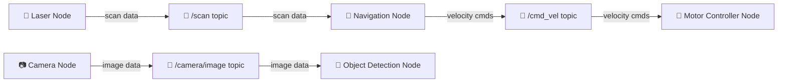

# 🤖 ROS 2 Jazzy Crash Course 2025 — Complete Study Guide

> **Source:** ROS 2 Jazzy Crash Course 2025 (The Construct)
> **Target ROS 2 Distribution:** Jazzy
> **Language:** Python
> **Your Setup:** Ubuntu server on DigitalOcean with Docker
> **End Goal:** Drone project with ROS 2

---

## 📋 Table of Contents

| # | Part | Topics Covered |
|---|------|---------------|
| 1 | [ROS 2 Basic Concepts](#part-1--ros-2-basic-concepts) | Packages, Nodes, Workspaces, Launch Files, Building |
| 2 | [ROS 2 Topics & Multi-threading](#part-2--ros-2-topics--multi-threading) | Publishers, Subscribers, Messages, Interfaces, Multi-threading |
| 3 | [Visualizing Robot Data with RViz 2](#part-3--visualizing-robot-data-with-rviz-2) | RViz 2, Sensor Visualization, Robot Models |
| 4 | [Robot Frames & Transformations (TF2)](#part-4--robot-frames--transformations-tf2) | TF2, Coordinate Frames, Transforms |
| 5 | [Introduction to DDS](#part-5--introduction-to-dds) | Data Distribution Service, QoS, Middleware |

---

## 🛠️ Environment Setup (Before You Start)

Since you're using an **Ubuntu server on DigitalOcean with Docker**, here's how to get ROS 2 Jazzy running:

### Option A: Docker (Recommended for your setup)

```bash
# Pull the official ROS 2 Jazzy image
docker pull osrf/ros:jazzy-desktop

# Run with GUI support (if needed) or headless
docker run -it --name ros2_jazzy osrf/ros:jazzy-desktop bash

# Inside the container, verify ROS 2
source /opt/ros/jazzy/setup.bash
ros2 --help
```

### Option B: Native Install on Ubuntu 24.04

```bash
# Set locale
sudo apt update && sudo apt install locales
sudo locale-gen en_US en_US.UTF-8
sudo update-locale LC_ALL=en_US.UTF-8 LANG=en_US.UTF-8

# Add ROS 2 repo
sudo apt install software-properties-common
sudo add-apt-repository universe
sudo apt update && sudo apt install curl -y
sudo curl -sSL https://raw.githubusercontent.com/ros/rosdistro/master/ros.key -o /usr/share/keyrings/ros-archive-keyring.gpg
echo "deb [arch=$(dpkg --print-architecture) signed-by=/usr/share/keyrings/ros-archive-keyring.gpg] http://packages.ros.org/ros2/ubuntu $(. /etc/os-release && echo $UBUNTU_CODENAME) main" | sudo tee /etc/apt/sources.list.d/ros2.list > /dev/null

# Install ROS 2 Jazzy
sudo apt update
sudo apt install ros-jazzy-desktop

# Source ROS 2
source /opt/ros/jazzy/setup.bash

# Add to bashrc so it's automatic
echo "source /opt/ros/jazzy/setup.bash" >> ~/.bashrc
```

### Essential Tools

```bash
# Install colcon (build tool)
sudo apt install python3-colcon-common-extensions

# Install rosdep (dependency manager)
sudo apt install python3-rosdep2
rosdep update
```

> [!TIP]
> Add `source /opt/ros/jazzy/setup.bash` to your `~/.bashrc` so you don't have to run it every time you open a terminal.

---

# Part 1 — ROS 2 Basic Concepts

> **Goal:** Understand the foundational building blocks of ROS 2 — packages, nodes, workspaces, launch files, and the build system.

---

## 1.1 Your First ROS 2 Command — Moving a Robot

Before diving into theory, let's see ROS 2 in action. This command starts a program that lets you control a robot with your keyboard:

```bash
# Terminal 1: Source your ROS 2 workspace
source /opt/ros/jazzy/setup.bash

# Start the keyboard teleoperation program
ros2 run teleop_twist_keyboard teleop_twist_keyboard
```

### Keyboard Controls

| Key | Action |
|-----|--------|
| `i` | Move forward |
| `k` | Stop |
| `,` | Move backward |
| `u` / `j` | Rotate/turn left |
| `o` / `l` | Rotate/turn right |

### Understanding the Command Structure

```
ros2 run <package_name> <executable_name>
```

- **`ros2 run`** — Command to start a single ROS 2 program
- **`teleop_twist_keyboard`** (1st) — The **package** containing the program
- **`teleop_twist_keyboard`** (2nd) — The **executable** file (the actual program)

> [!NOTE]
> `ros2 run` is one of two ways to start ROS 2 programs. The other is `ros2 launch` (covered later).

---

## 1.2 ROS 2 Packages

### What is a Package?

A **package** is the primary organizational unit in ROS 2. Think of it as a folder that contains all the files for a specific ROS 2 program.

**Key rule:** Every ROS 2 program you create must be inside a package.

### Python Package Structure

```
my_package/
├── my_package/          # Python scripts go here (same name as package)
│   ├── __init__.py
│   └── simple.py        # Your ROS 2 program
├── launch/              # Launch files (you create this)
│   └── my_package_launch_file.launch.py
├── package.xml          # Package metadata & dependencies
├── setup.cfg            # Defines where scripts are installed
└── setup.py             # Build instructions & entry points
```

| File | Purpose |
|------|---------|
| `package.xml` | Meta information about the package (name, version, dependencies) |
| `setup.py` | Specifies how to build the package, defines executables |
| `setup.cfg` | Defines where scripts will be installed |
| `my_package/__init__.py` | Makes the directory a Python package |

### Package Types

| Type | Build Type Flag | Language | Use Case |
|------|----------------|----------|----------|
| **Python** (ament_python) | `--build-type ament_python` | Python | What we use in this course |
| **CMake** (ament_cmake) | `--build-type ament_cmake` | C++ | Performance-critical applications |

---

## 1.3 ROS 2 Workspaces

### What is a Workspace?

A **workspace** is the top-level directory where your packages live. It has a specific structure:

```
ros2_ws/                  # Workspace root (typical name: ros2_ws)
├── src/                  # ALL packages go inside src/
│   ├── my_package/
│   ├── another_package/
│   └── yet_another_pkg/
├── build/                # Auto-generated during build
├── install/              # Auto-generated during build (compiled packages)
└── log/                  # Auto-generated during build
```

> [!IMPORTANT]
> - Packages are **always** created inside the `src/` folder
> - Building is **always** done from the **workspace root** (not `src/`)
> - The `build/`, `install/`, and `log/` folders are auto-generated — don't edit them manually

### Create Your Workspace

```bash
# Create workspace directory
mkdir -p ~/ros2_ws/src

# Navigate to workspace root
cd ~/ros2_ws
```

---

## 1.4 Creating Your First Package

### Step 1: Navigate to the `src` folder

```bash
cd ~/ros2_ws/src
```

### Step 2: Create the package

```bash
ros2 pkg create --build-type ament_python my_package --dependencies rclpy
```

**Breaking down the command:**

| Part | Meaning |
|------|---------|
| `ros2 pkg create` | Command to create a new package |
| `--build-type ament_python` | Creating a Python package |
| `my_package` | Name of the package |
| `--dependencies rclpy` | Dependencies (rclpy = ROS 2 Client Library for Python) |

### Step 3: Verify the package was created

```bash
ls ~/ros2_ws/src/my_package/
```

You should see: `my_package/`, `package.xml`, `setup.cfg`, `setup.py`, etc.

---

## 1.5 Building Packages

### Build all packages in workspace

```bash
# MUST be in workspace root!
cd ~/ros2_ws
colcon build
```

### Build a specific package only

```bash
cd ~/ros2_ws
colcon build --packages-select my_package
```

> [!TIP]
> Use `--packages-select` when you have many packages but only changed one — it's much faster than rebuilding everything.

### Source the workspace after building

```bash
source ~/ros2_ws/install/setup.bash
```

> [!IMPORTANT]
> **Every time** you build a package, you must source the workspace to use the latest version:
> ```bash
> source ~/ros2_ws/install/setup.bash
> ```
> The file you always source is `setup.bash` inside the `install/` folder.

---

## 1.6 Creating Your First ROS 2 Program

### Step 1: Create the Python script

Create a file at `~/ros2_ws/src/my_package/my_package/simple.py`:

#### Version 1 — Minimal (just prints a message)

```python
import rclpy

def main(args=None):
    rclpy.init(args=args)        # Initialize ROS 2 communication
    print("Help me Obi-Wan Kenobi, you're my only hope!")
    rclpy.shutdown()             # Shut down ROS 2 communication

if __name__ == '__main__':
    main()
```

#### Version 2 — Proper ROS 2 Node (with timer & logger)

```python
import rclpy
from rclpy.node import Node      # Import the Node class

class MyNode(Node):
    def __init__(self):
        super().__init__('obi_wan')     # Initialize node with name 'obi_wan'
        self.timer = self.create_timer(0.2, self.timer_callback)  # Every 0.2 seconds
    
    def timer_callback(self):
        self.get_logger().info("Help me Obi-Wan Kenobi, you're my only hope!")

def main(args=None):
    rclpy.init(args=args)              # Initialize ROS 2 communication
    node = MyNode()                     # Create an instance of our node
    rclpy.spin(node)                    # Keep node running until Ctrl+C
    rclpy.shutdown()                    # Shut down ROS 2 communication

if __name__ == '__main__':
    main()
```

**Key Concepts in Version 2:**

| Concept | Explanation |
|---------|-------------|
| `class MyNode(Node)` | Our class inherits from the ROS 2 `Node` class |
| `super().__init__('obi_wan')` | Initializes the node with the name `obi_wan` |
| `self.create_timer(0.2, self.timer_callback)` | Creates a timer that calls `timer_callback` every 0.2 seconds |
| `self.get_logger().info(...)` | The **proper** ROS 2 way to print log messages (not `print()`) |
| `rclpy.spin(node)` | Keeps the program running, processing callbacks, until you press `Ctrl+C` |
| **Callback** | A function that is executed periodically or in response to an event |

---

## 1.7 Launch Files

### What is a Launch File?

A **launch file** lets you start **multiple ROS 2 programs at once** and configure them. This is the standard way to start complex ROS 2 systems.

| Method | Starts | Use Case |
|--------|--------|----------|
| `ros2 run` | One program | Quick testing |
| `ros2 launch` | Multiple programs | Production, complex systems |

### Command Structure

```
ros2 launch <package_name> <launch_file_name>
```

### Creating a Launch File

#### Step 1: Create the `launch/` directory inside your package

```bash
mkdir -p ~/ros2_ws/src/my_package/launch
```

#### Step 2: Create the launch file

Create `~/ros2_ws/src/my_package/launch/my_package_launch_file.launch.py`:

```python
from launch import LaunchDescription
from launch_ros.actions import Node

def generate_launch_description():
    return LaunchDescription([
        Node(
            package='my_package',         # Package name
            executable='simple_node',     # Executable name (from setup.py)
            output='screen'               # Show output in terminal
        ),
    ])
```

> [!NOTE]
> Launch file naming convention: `<name>.launch.py`
> - The `.launch.py` extension tells ROS 2 this is a Python-based launch file
> - Launch files can also be written in XML or YAML

---

## 1.8 Configuring setup.py

Before your package can be built with executables and launch files, you need to configure `setup.py`.

### The Complete setup.py

```python
import os
from glob import glob
from setuptools import find_packages, setup

package_name = 'my_package'

setup(
    name=package_name,
    version='0.0.0',
    packages=find_packages(exclude=['test']),
    data_files=[
        ('share/ament_index/resource_index/packages',
            ['resource/' + package_name]),
        ('share/' + package_name, ['package.xml']),
        # Install ALL launch files
        (os.path.join('share', package_name, 'launch'),
            glob(os.path.join('launch', '*launch.[pxy][yma]*'))),
    ],
    install_requires=['setuptools'],
    zip_safe=True,
    maintainer='your_name',
    maintainer_email='your_email@example.com',
    description='My first ROS 2 package',
    license='Apache-2.0',
    tests_require=['pytest'],
    entry_points={
        'console_scripts': [
            # Format: 'executable_name = package_name.script_name:main'
            'simple_node = my_package.simple:main',
        ],
    },
)
```

### Two Critical Additions Explained

#### 1. Entry Points (Creating Executables)

```python
entry_points={
    'console_scripts': [
        'simple_node = my_package.simple:main',
    ],
},
```

**Format:** `'executable_name = package_name.script_name:main_function'`

| Part | Meaning |
|------|---------|
| `simple_node` | Name of the executable you create |
| `my_package` | Your ROS 2 package name |
| `simple` | The Python script filename (without `.py`) |
| `main` | The function to execute when this executable runs |

#### 2. Data Files (Installing Launch Files)

```python
(os.path.join('share', package_name, 'launch'),
    glob(os.path.join('launch', '*launch.[pxy][yma]*'))),
```

This tells the build system: *"Install all launch files from the `launch/` folder into the package's share directory."*

#### 3. Don't forget the imports!

```python
import os
from glob import glob
```

> [!CAUTION]
> The executable name in `setup.py` must **exactly match** the executable name in your launch file. If `setup.py` says `simple_node` but your launch file says `simple`, you'll get:
> ```
> executable 'simple' not found
> ```

---

## 1.9 Build → Source → Run Workflow

This is the workflow you'll repeat constantly. Memorize it!

```
┌─────────────────────────────────────────────────┐
│  1. Edit code (scripts, launch files, setup.py) │
│  2. cd ~/ros2_ws                                │
│  3. colcon build --packages-select my_package   │
│  4. source install/setup.bash                   │
│  5. ros2 launch my_package <launch_file>        │
└─────────────────────────────────────────────────┘
```

```bash
# Full workflow example:
cd ~/ros2_ws
colcon build --packages-select my_package
source install/setup.bash
ros2 launch my_package my_package_launch_file.launch.py
```

---

## 1.10 ROS 2 Nodes

### What is a Node?

A **node** is a ROS 2 program. Every ROS 2 program runs as a node. Nodes can **communicate with each other** to exchange information.

```
┌──────────┐    messages     ┌──────────┐
│  Node A  │ ──────────────► │  Node B  │
│ (Laser)  │                 │ (Nav)    │
└──────────┘                 └──────────┘
       │                          │
       │        messages          │
       └──────────────────────────┘
```

### Node Commands

| Command | Description | Example |
|---------|-------------|---------|
| `ros2 node list` | List all currently running nodes | `ros2 node list` |
| `ros2 node info <node_name>` | Get detailed info about a specific node | `ros2 node info /obi_wan` |

### Example

```bash
# List all running nodes
ros2 node list

# Get info about a specific node
ros2 node info /obi_wan
```

Node info shows:
- **Subscribers** — Topics the node reads from
- **Publishers** — Topics the node writes to
- **Services** — Services the node offers/uses
- **Actions** — Actions the node offers/uses

---

## 1.11 What is ROS 2? (The Big Picture)

> **ROS 2 is a middleware framework that manages communication between nodes in a robotic system.**



- Multiple **nodes** each handle one responsibility
- Nodes exchange information through **topics** (and other methods)
- ROS 2 manages this entire ecosystem of communication
- This architecture scales from simple robots to very complex systems

---

## ✅ Part 1 — Summary Checklist

- [ ] Understand what a **package** is and its structure
- [ ] Understand what a **workspace** is (`ros2_ws/src/`)
- [ ] Created a new package with `ros2 pkg create`
- [ ] Created a Python ROS 2 program with a **Node** class
- [ ] Configured `setup.py` with entry points and launch file installation
- [ ] Created a **launch file**
- [ ] Built the package with `colcon build`
- [ ] Sourced the workspace with `source install/setup.bash`
- [ ] Ran the program with `ros2 launch`
- [ ] Used `ros2 node list` and `ros2 node info`
- [ ] Understand what ROS 2 is at a high level

---

# Part 2 — ROS 2 Topics & Multi-threading

> **Goal:** Understand the primary communication method in ROS 2 — topics. Learn to create publishers, subscribers, and handle multi-threading.

---

## 2.1 What are Topics?

A **topic** is a named communication channel through which nodes exchange data. Think of it as a **pipe** that data flows through.

```
┌────────────┐              ┌────────────┐
│ Publisher   │ ──message──► │ Subscriber │
│ Node       │    Topic     │ Node       │
└────────────┘   "/scan"    └────────────┘
```

Key concepts:

| Concept | Definition |
|---------|-----------|
| **Topic** | A named channel for data flow (e.g., `/scan`, `/cmd_vel`) |
| **Message** | The data structure sent through a topic |
| **Publisher** | A node that **sends** data to a topic |
| **Subscriber** | A node that **reads** data from a topic |

> [!NOTE]
> - A topic can have **multiple publishers** and **multiple subscribers**
> - Messages have specific **types** (structures) depending on what data they carry
> - Different topics can use different message types

---

## 2.2 Topic Command Line Tools

### List all topics

```bash
ros2 topic list
```

This outputs all topics currently active in the ROS 2 system. In a simulation, you'll see topics like:
- `/scan` — Laser sensor data
- `/rosbot_xl_base_controller/cmd_vel` — Velocity commands to the robot
- `/imu` — IMU sensor data

### Get info about a specific topic

```bash
ros2 topic info /rosbot_xl_base_controller/cmd_vel
```

Output shows:
- **Type** — The message type used (e.g., `geometry_msgs/msg/TwistStamped`)
- **Publisher count** — How many nodes are publishing to it (0 = nobody sending data)
- **Subscription count** — How many nodes are subscribed to it

### Subscribe to a topic (read data)

```bash
ros2 topic echo /rosbot_xl_base_controller/cmd_vel
```

This will continuously print messages as they are published to the topic.

> [!TIP]
> If nothing appears after running `echo`, it means **nobody is publishing** to that topic right now. This is normal! You need a publisher (like `teleop_twist_keyboard`) running in another terminal to see data flow.

**Practical demo:**
```bash
# Terminal 1: Subscribe (will show nothing initially)
ros2 topic echo /rosbot_xl_base_controller/cmd_vel

# Terminal 2: Start teleop to publish velocity commands
ros2 run teleop_twist_keyboard teleop_twist_keyboard

# Now Terminal 1 will start showing messages as you press keys!
```

### Publish to a topic (send data)

```bash
ros2 topic pub /rosbot_xl_base_controller/cmd_vel geometry_msgs/msg/TwistStamped \
  "{ twist: { angular: { z: 0.5 } } }"
```

**Command structure:**
```
ros2 topic pub <topic_name> <message_type> "<message_data>"
```

- `ros2 topic echo` = **subscribe** (read from a topic)
- `ros2 topic pub` = **publish** (write to a topic)

These are counterparts: `echo` reads, `pub` writes.

### Measure publishing frequency

```bash
ros2 topic hz /scan
```

Shows how frequently messages are being published (in Hz).

### Quick Reference Table

| Command | Purpose |
|---------|---------|
| `ros2 topic list` | List all active topics |
| `ros2 topic info <topic>` | Info about a topic (type, pub/sub count) |
| `ros2 topic echo <topic>` | Read/subscribe to a topic's messages |
| `ros2 topic pub <topic> <type> "<data>"` | Publish a message to a topic |
| `ros2 topic hz <topic>` | Measure publishing frequency |
| `ros2 topic -h` | Show all available topic subcommands |

---

## 2.3 ROS 2 Interfaces (Messages)

Every topic uses a specific **message type** (also called an interface). Different types of data need different message structures — it's not the same to send laser data vs camera images vs velocity commands.

### Examples of Message Types

| Message Type | Package | Used For |
|-------------|---------|----------|
| `geometry_msgs/msg/Twist` | geometry_msgs | Velocity commands (linear + angular) |
| `geometry_msgs/msg/TwistStamped` | geometry_msgs | Velocity commands with timestamp |
| `sensor_msgs/msg/LaserScan` | sensor_msgs | Laser/LIDAR data |
| `sensor_msgs/msg/Image` | sensor_msgs | Camera images |
| `sensor_msgs/msg/Imu` | sensor_msgs | IMU (accelerometer/gyroscope) data |

### Interface Command Line Tools

```bash
# List ALL available message types
ros2 interface list

# Show the structure of a specific message
ros2 interface show geometry_msgs/msg/TwistStamped

# Show a prototype (template) — exact formatting for publishing
ros2 interface proto geometry_msgs/msg/TwistStamped
```

> [!TIP]
> Use `ros2 interface proto` to get the **exact format** you need when publishing messages from the command line with `ros2 topic pub`.

### Example: TwistStamped Message Structure

```
# ros2 interface show geometry_msgs/msg/TwistStamped
std_msgs/Header header          ← Level 1
    builtin_interfaces/Time stamp
        int32 sec
        uint32 nanosec
    string frame_id
geometry_msgs/Twist twist       ← Level 1
    geometry_msgs/Vector3 linear    ← Level 2
        float64 x                       ← Level 3
        float64 y
        float64 z
    geometry_msgs/Vector3 angular   ← Level 2
        float64 x                       ← Level 3
        float64 y
        float64 z
```

### ⚠️ Common Gotcha: Message Hierarchy

> [!CAUTION]
> **This is a trap that catches everyone!** When accessing fields in a `TwistStamped` message in Python, you must follow the **full hierarchy**. You cannot skip levels!
>
> ```python
> msg = TwistStamped()
>
> # ❌ WRONG — will cause AttributeError!
> msg.linear.x = 0.5
>
> # ✅ CORRECT — must go through 'twist' first!
> msg.twist.linear.x = 0.5
> msg.twist.angular.z = 0.3
> ```
>
> The error you'll see: `AttributeError: 'TwistStamped' object has no attribute 'linear'`
>
> **Why?** Because `TwistStamped` has two top-level fields: `header` and `twist`. The `linear` and `angular` fields are inside `twist`, not directly on the message.

### Understanding Velocity Commands

For a differential drive robot (and many drones!):

| Field | Axis | Effect |
|-------|------|--------|
| `twist.linear.x` | X | Forward (+) / Backward (-) |
| `twist.angular.z` | Z | Rotate left (+) / Rotate right (-) |

---

## 2.4 Creating a Publisher Node (Step by Step)

This follows the exact process from the video — creating a **new package** specifically for the publisher.

### Step 1: Create the package

```bash
cd ~/ros2_ws/src
ros2 pkg create --build-type ament_python publisher_package --dependencies rclpy std_msgs geometry_msgs
```

> [!NOTE]
> We add `std_msgs` and `geometry_msgs` as dependencies because our publisher will use `TwistStamped` from `geometry_msgs`.

### Step 2: Create the publisher script

Create `~/ros2_ws/src/publisher_package/publisher_package/simple_publisher.py`:

```python
import rclpy
from rclpy.node import Node
from geometry_msgs.msg import TwistStamped  # Import the message type

class SimplePublisher(Node):
    def __init__(self):
        super().__init__('simple_publisher')
        
        # Create a publisher
        # Parameters: message_type, topic_name, QoS
        self.publisher_ = self.create_publisher(
            TwistStamped,
            '/rosbot_xl_base_controller/cmd_vel',
            10
        )
        
        # Create a timer to publish every 0.5 seconds
        self.timer = self.create_timer(0.5, self.timer_callback)
        
        self.get_logger().info('Publisher node started!')
    
    def timer_callback(self):
        msg = TwistStamped()
        
        # ⚠️ Must access through twist → linear/angular (NOT directly!)
        msg.twist.linear.x = 0.0       # No forward motion
        msg.twist.angular.z = 0.5      # Rotate at 0.5 rad/s
        
        self.publisher_.publish(msg)    # Publish the message
        self.get_logger().info('Publishing velocity command')

def main(args=None):
    rclpy.init(args=args)
    node = SimplePublisher()
    rclpy.spin(node)
    node.destroy_node()
    rclpy.shutdown()

if __name__ == '__main__':
    main()
```

### Step 3: Create the launch file

```bash
mkdir -p ~/ros2_ws/src/publisher_package/launch
```

Create `~/ros2_ws/src/publisher_package/launch/publisher_package_launch_file.launch.py`:

```python
from launch import LaunchDescription
from launch_ros.actions import Node

def generate_launch_description():
    return LaunchDescription([
        Node(
            package='publisher_package',
            executable='simple_publisher',
            output='screen'
        ),
    ])
```

### Step 4: Update setup.py

In `~/ros2_ws/src/publisher_package/setup.py`, add:

```python
import os
from glob import glob

# In data_files list, add:
(os.path.join('share', package_name, 'launch'),
    glob(os.path.join('launch', '*launch.[pxy][yma]*'))),

# In entry_points → console_scripts, add:
'simple_publisher = publisher_package.simple_publisher:main',
```

### Step 5: Build, source, run

```bash
cd ~/ros2_ws
colcon build --packages-select publisher_package
source install/setup.bash
ros2 launch publisher_package publisher_package_launch_file.launch.py
```

**Expected result:** The robot starts rotating (angular.z = 0.5).

### Key Publisher API

```python
# Create a publisher
self.publisher_ = self.create_publisher(
    MessageType,     # e.g., TwistStamped
    'topic_name',    # e.g., '/rosbot_xl_base_controller/cmd_vel'
    queue_size       # e.g., 10 (buffer size)
)

# Publish a message
self.publisher_.publish(msg)
```

---

## 2.5 Creating a Subscriber Node (Step by Step)

A subscriber node **reads data** from a topic. Every subscriber has a **callback function** that fires each time a new message arrives.

### Step 1: Create the package

```bash
cd ~/ros2_ws/src
ros2 pkg create --build-type ament_python subscriber_package --dependencies rclpy sensor_msgs
```

### Step 2: Create the subscriber script

Create `~/ros2_ws/src/subscriber_package/subscriber_package/simple_subscriber.py`:

```python
import rclpy
from rclpy.node import Node
from sensor_msgs.msg import LaserScan  # Import the message type

class SimpleSubscriber(Node):
    def __init__(self):
        super().__init__('simple_subscriber')
        
        # Create a subscription
        # Parameters: message_type, topic_name, callback_function, QoS
        self.subscription = self.create_subscription(
            LaserScan,
            '/scan',
            self.listener_callback,
            10
        )
        
        self.get_logger().info('Subscriber node started!')
    
    def listener_callback(self, msg):
        # This function is called EVERY TIME a new message arrives on /scan
        # msg.ranges is an array of distance readings from the laser
        self.get_logger().info(f'Ranges: {msg.ranges}')

def main(args=None):
    rclpy.init(args=args)
    node = SimpleSubscriber()
    rclpy.spin(node)
    node.destroy_node()
    rclpy.shutdown()

if __name__ == '__main__':
    main()
```

### Step 3: Create launch file & update setup.py

*(Same process as publisher — create `launch/` dir, launch file, update `setup.py`)*

```python
# setup.py entry point:
'simple_subscriber = subscriber_package.simple_subscriber:main',
```

### Step 4: Build, source, run

```bash
cd ~/ros2_ws
colcon build --packages-select subscriber_package
source install/setup.bash
ros2 launch subscriber_package subscriber_package_launch_file.launch.py
```

**Expected result:** Continuous output showing laser range readings — arrays of distance values in meters.

### Key Subscriber API

```python
# Create a subscription
self.subscription = self.create_subscription(
    MessageType,         # e.g., LaserScan
    'topic_name',        # e.g., '/scan'
    self.callback_func,  # Function called when message arrives
    queue_size           # e.g., 10
)
```

### Understanding LaserScan Data

```
How a laser/LIDAR works:
                    
        beam₁  beam₂  beam₃
          \     |     /
           \    |    /
            \   |   /
         ====ROBOT====
         
Each beam hits an obstacle and returns the DISTANCE.
These distances are stored in msg.ranges[] array.
```

| Field | Description |
|-------|-------------|
| `msg.ranges` | Array of distance values (meters) for each laser beam |
| `msg.angle_min` | Start angle of the scan |
| `msg.angle_max` | End angle of the scan |
| `msg.angle_increment` | Angular distance between beams |
| `msg.range_min` | Minimum detectable distance |
| `msg.range_max` | Maximum detectable distance |

---

## 2.6 Publisher + Subscriber in One Node: Obstacle Avoidance

This is the **key practical example** from the video. A single node that:
1. **Subscribes** to `/scan` (laser data) to detect obstacles
2. **Publishes** to `/cmd_vel` (velocity commands) to control the robot
3. Uses **logic** to avoid obstacles based on laser readings

### Create the package

```bash
cd ~/ros2_ws/src
ros2 pkg create --build-type ament_python robot_patrol --dependencies rclpy sensor_msgs geometry_msgs
```

### The Patrol Program

Create `~/ros2_ws/src/robot_patrol/robot_patrol/patrol.py`:

```python
import rclpy
from rclpy.node import Node
from sensor_msgs.msg import LaserScan
from geometry_msgs.msg import TwistStamped
import math

class PatrolNode(Node):
    def __init__(self):
        super().__init__('patrol_node')
        
        # --- Subscriber: Laser data ---
        self.laser_sub = self.create_subscription(
            LaserScan, '/scan', self.laser_callback, 10)
        
        # --- Publisher: Velocity commands ---
        self.cmd_pub = self.create_publisher(
            TwistStamped,
            '/rosbot_xl_base_controller/cmd_vel',
            10
        )
        
        # --- Control Timer: runs every 0.5 seconds ---
        self.control_timer = self.create_timer(0.5, self.motion)
        
        # --- Initialize variables ---
        self.cmd = TwistStamped()
        self.cmd.twist.linear.x = 0.0
        self.cmd.twist.angular.z = 0.0
        
        # Thresholds
        self.min_distance = 0.55       # meters — stop if obstacle closer than this
        self.side_threshold = 0.40     # meters — side safety margin
        
        # Laser readings (will be updated by callback)
        self.front = float('inf')
        self.left = float('inf')
        self.right = float('inf')
        
        self.get_logger().info('Patrol node started!')
    
    def laser_callback(self, msg):
        """Called every time new laser data arrives."""
        # Extract readings for specific directions
        # These indices depend on the laser configuration:
        #   index 0     → front of robot
        #   index ~246  → right side
        #   index ~493  → left side (for a ~720-beam laser)
        
        num_ranges = len(msg.ranges)
        self.right = msg.ranges[num_ranges // 4]        # ~90° right
        self.front = msg.ranges[0]                       # straight ahead
        self.left  = msg.ranges[(3 * num_ranges) // 4]   # ~90° left
        
        self.get_logger().info(f'Front: {self.front:.2f}m')
    
    def motion(self):
        """Control logic — executed every 0.5 seconds by the timer."""
        
        if self.left < self.side_threshold and self.front > self.min_distance:
            # Left side too close, but front is clear → slow down & turn right
            self.cmd.twist.linear.x = 0.35 * 0.25
            self.cmd.twist.angular.z = -0.3
        
        elif self.right < self.side_threshold and self.front > self.min_distance:
            # Right side too close, but front is clear → slow down & turn left
            self.cmd.twist.linear.x = 0.35 * 0.25
            self.cmd.twist.angular.z = 0.3
        
        elif self.front > self.min_distance:
            # Front is clear → move forward!
            self.cmd.twist.linear.x = 0.35
            self.cmd.twist.angular.z = 0.0
        
        else:
            # Obstacle ahead! Stop and rotate to the clearer side
            self.cmd.twist.linear.x = 0.35 * 0.25  # Slow down significantly
            self.cmd.twist.angular.z = self.choose_turn_direction()
        
        # Publish the velocity command
        self.cmd_pub.publish(self.cmd)
    
    def choose_turn_direction(self):
        """Turn toward the side with more clearance."""
        if self.left > self.right:
            return 0.5   # Turn left (positive angular.z)
        else:
            return -0.5  # Turn right (negative angular.z)

def main(args=None):
    rclpy.init(args=args)
    node = PatrolNode()
    try:
        rclpy.spin(node)
    except KeyboardInterrupt:
        pass
    finally:
        node.destroy_node()
        rclpy.shutdown()

if __name__ == '__main__':
    main()
```

### Launch File (with colored output)

```python
from launch import LaunchDescription
from launch_ros.actions import Node

def generate_launch_description():
    return LaunchDescription([
        Node(
            package='robot_patrol',
            executable='patrol_node',
            output='screen',
            emulate_tty=True    # ← Enables colored log messages!
        ),
    ])
```

> [!TIP]
> Adding `emulate_tty=True` to your launch file enables colored log messages in the terminal:
> - 🟢 **Green** = INFO (debug messages)
> - 🟡 **Yellow** = WARN (warnings)
> - 🔴 **Red** = ERROR (errors)

### How the Obstacle Avoidance Logic Works

```
                    FRONT (index 0)
                      ↑
                      |
         LEFT ←───  ROBOT  ───→ RIGHT
      (3N/4)          |          (N/4)
                      ↓
                    BACK

Decision tree:
┌────────────────────────────────────────────────┐
│ Is front distance > 0.55m?                     │
│   YES → Move forward at 0.35 m/s              │
│   NO  → Obstacle ahead!                       │
│         ├─ Left > Right? → Turn LEFT           │
│         └─ Right > Left? → Turn RIGHT          │
└────────────────────────────────────────────────┘
```

---

## 2.7 Multi-threading in ROS 2

> This section is **critical** for real robotics. Understanding this will prevent subtle bugs where your robot stops responding.

### The Problem: Callback Blocking

By default, ROS 2 uses a **SingleThreadedExecutor**. All callbacks run on **one thread**, one after another. If one callback takes a long time, **all other callbacks are blocked**.

#### Demonstration: The Video Processing Problem

Imagine adding a heavy "video processing" callback to our patrol node:

```python
import time

class PatrolNode(Node):
    def __init__(self):
        # ... existing code (laser sub, cmd pub, control timer) ...
        
        # NEW: Add a heavy processing timer
        self.video_timer = self.create_timer(0.5, self.process_video)
    
    def process_video(self):
        """Simulates heavy processing — takes 3 seconds!"""
        self.get_logger().info('Processing video...')
        time.sleep(3)  # ← This blocks everything for 3 seconds!
```

**What happens with SingleThreadedExecutor:**

```
Timeline:
─────────────────────────────────────────────────────────
laser_callback ✓  │  motion ✓  │  process_video... 3 sec BLOCKED!
                                  laser_callback ✗ WAITING
                                  motion ✗ WAITING
─────────────────────────────────────────────────────────
```

**Result:** The robot moves in jerky intervals — moves for 0.5s, freezes for 3s, moves for 0.5s, freezes for 3s. It crashes into obstacles because it can't react in real time!

---

### Step 1: Try MultiThreadedExecutor (Not Enough!)

The first thing you might try is switching to `MultiThreadedExecutor`:

```python
from rclpy.executors import MultiThreadedExecutor

def main(args=None):
    rclpy.init(args=args)
    node = PatrolNode()
    
    # Use multi-threaded executor
    executor = MultiThreadedExecutor()
    executor.add_node(node)
    executor.spin()
    
    node.destroy_node()
    executor.shutdown()
    rclpy.shutdown()
```

**But this STILL doesn't work!** The robot still freezes. Why?

> [!IMPORTANT]
> **Key insight:** `MultiThreadedExecutor` provides multiple threads, BUT by default all callbacks belong to the same `MutuallyExclusiveCallbackGroup`. This means even with multiple threads available, **callbacks in the same group still execute one at a time**.
>
> The `MultiThreadedExecutor` alone is necessary but **not sufficient**. You also need **Callback Groups**.

---

### Step 2: The Solution — Callback Groups

**Callback Groups** tell ROS 2 which callbacks can run in parallel and which must wait for each other.

| Callback Group Type | Behavior | When to Use |
|---------------------|----------|-------------|
| `MutuallyExclusiveCallbackGroup` | Only ONE callback in this group runs at a time | **Default** for all callbacks |
| `ReentrantCallbackGroup` | Multiple callbacks can run **simultaneously** | Independent tasks that don't share data |

#### The Fix: Separate callback groups

```python
import rclpy
import time
from rclpy.node import Node
from rclpy.executors import MultiThreadedExecutor
from rclpy.callback_groups import ReentrantCallbackGroup, MutuallyExclusiveCallbackGroup
from sensor_msgs.msg import LaserScan
from geometry_msgs.msg import TwistStamped

class PatrolNode(Node):
    def __init__(self):
        super().__init__('patrol_node')
        
        # ═══════════════════════════════════════════
        # KEY: Create SEPARATE callback groups
        # ═══════════════════════════════════════════
        self.group1 = MutuallyExclusiveCallbackGroup()  # For robot control
        self.group2 = MutuallyExclusiveCallbackGroup()  # For heavy processing
        #     ↑ These are DIFFERENT groups, so they CAN run in parallel!
        
        # Laser subscriber — in group 1 (control)
        self.laser_sub = self.create_subscription(
            LaserScan, '/scan', self.laser_callback, 10,
            callback_group=self.group1    # ← Assign to group 1
        )
        
        # Velocity publisher
        self.cmd_pub = self.create_publisher(
            TwistStamped,
            '/rosbot_xl_base_controller/cmd_vel', 10)
        
        # Control timer — in group 1 (control)
        self.control_timer = self.create_timer(
            0.5, self.motion,
            callback_group=self.group1    # ← Assign to group 1
        )
        
        # Heavy processing timer — in group 2 (separate!)
        self.video_timer = self.create_timer(
            0.5, self.process_video,
            callback_group=self.group2    # ← Assign to group 2 (won't block group 1!)
        )
        
        # ... rest of initialization ...
        self.cmd = TwistStamped()
        self.front = float('inf')
        self.left = float('inf')
        self.right = float('inf')
        self.min_distance = 0.55
        self.side_threshold = 0.40
    
    def laser_callback(self, msg):
        num_ranges = len(msg.ranges)
        self.right = msg.ranges[num_ranges // 4]
        self.front = msg.ranges[0]
        self.left  = msg.ranges[(3 * num_ranges) // 4]
    
    def motion(self):
        """Control logic — runs on group 1 thread."""
        if self.front > self.min_distance:
            self.cmd.twist.linear.x = 0.35
            self.cmd.twist.angular.z = 0.0
        else:
            self.cmd.twist.linear.x = 0.35 * 0.25
            if self.left > self.right:
                self.cmd.twist.angular.z = 0.5
            else:
                self.cmd.twist.angular.z = -0.5
        self.cmd_pub.publish(self.cmd)
    
    def process_video(self):
        """Heavy task — runs on group 2 thread (doesn't block control!)."""
        self.get_logger().info('Processing video...')
        time.sleep(3)
        self.get_logger().info('Video processing done!')

def main(args=None):
    rclpy.init(args=args)
    node = PatrolNode()
    
    # MUST use MultiThreadedExecutor with callback groups!
    executor = MultiThreadedExecutor()
    executor.add_node(node)
    
    try:
        executor.spin()
    except KeyboardInterrupt:
        pass
    finally:
        node.destroy_node()
        executor.shutdown()
        rclpy.shutdown()
```

**Now the timeline looks like this:**

```
Thread 1 (group1): laser_cb ✓ → motion ✓ → laser_cb ✓ → motion ✓ → ...
Thread 2 (group2): process_video... (3 sec) ────────────────────────→ done
                   ↑ Doesn't block Thread 1!
```

**Result:** The robot moves smoothly AND processes video simultaneously. No more freezing!

---

### Multi-threading Summary

```
┌─────────────────────────────────────────────────────────────┐
│  Problem: One slow callback blocks everything               │
│                                                             │
│  Solution requires BOTH:                                    │
│  ┌─────────────────────┐  ┌──────────────────────────────┐  │
│  │ MultiThreadedExecutor│  │ Separate Callback Groups     │  │
│  │ (provides threads)  │  │ (allows parallel execution)  │  │
│  └─────────────────────┘  └──────────────────────────────┘  │
│                                                             │
│  Neither alone is sufficient — you need BOTH!               │
└─────────────────────────────────────────────────────────────┘
```

#### Comparison: Default vs Multi-threaded with Callback Groups

```python
# ❌ Default (single-threaded) — callbacks block each other
def main():
    rclpy.init()
    node = MyNode()
    rclpy.spin(node)    # ← SingleThreadedExecutor internally

# ❌ MultiThreadedExecutor WITHOUT callback groups — still blocks!
def main():
    rclpy.init()
    node = MyNode()     # All callbacks in DEFAULT group (MutuallyExclusive)
    executor = MultiThreadedExecutor()
    executor.add_node(node)
    executor.spin()     # ← Multiple threads, but same group = still sequential

# ✅ MultiThreadedExecutor WITH separate callback groups — parallel!
def main():
    rclpy.init()
    node = MyNode()     # Callbacks assigned to DIFFERENT groups
    executor = MultiThreadedExecutor()
    executor.add_node(node)
    executor.spin()     # ← Different groups can run on different threads
```

> [!IMPORTANT]
> **Rules of thumb:**
> 1. Callbacks that **must access the same data** → put in the **same** `MutuallyExclusiveCallbackGroup`
> 2. Callbacks that are **independent** → put in **different** groups
> 3. Use `ReentrantCallbackGroup` only when callbacks truly don't share any state
> 4. Always use `MultiThreadedExecutor` when you have multiple callback groups

---

## ✅ Part 2 — Summary Checklist

- [ ] Understand what **topics**, **messages**, **publishers**, and **subscribers** are
- [ ] Used `ros2 topic list`, `ros2 topic info`, `ros2 topic echo`, `ros2 topic pub`
- [ ] Used `ros2 interface show` and `ros2 interface proto`
- [ ] Understand the **TwistStamped message hierarchy** (msg.twist.linear.x, NOT msg.linear.x)
- [ ] Created a **publisher** node in its own package
- [ ] Created a **subscriber** node in its own package
- [ ] Created a **combined pub/sub node** (obstacle avoidance patrol)
- [ ] Understand the **callback blocking problem** with SingleThreadedExecutor
- [ ] Understand why `MultiThreadedExecutor` alone is NOT enough
- [ ] Understand **callback groups** (MutuallyExclusive vs Reentrant)
- [ ] Can implement multi-threading with **MultiThreadedExecutor + separate callback groups**

---

# Part 3 — Debugging ROS Programs with RViz 2

> **Goal:** Learn to use RViz 2 — the primary visualization and debugging tool in ROS 2. Understand how to visualize sensor data, robot models, and coordinate frames to find and fix problems.

---

## 3.1 What is RViz 2?

**RViz 2** is the main **debugging and visualization tool** in ROS 2. When your robot behaves unexpectedly, RViz lets you **see** what ROS thinks is happening — which sensors are publishing, what data they're sending, and whether the robot model is correct.

### Why Do We Need RViz?

Raw topic data is hard to interpret:

```bash
ros2 topic echo /scan
# Output: walls of numbers like:
# ranges: [0.45, 0.46, 0.47, 0.48, inf, inf, 0.52, ...]
# intensities: [0.0, 0.0, 0.0, ...]
```

You can't tell from this whether the laser is working correctly, where obstacles are, or if there's a problem. **RViz shows this data graphically** — you can see the laser beams as points in 3D space around the robot.

### Launching RViz 2

```bash
rviz2
```

> [!NOTE]
> If your project has custom robot models, you may need to source the workspace first:
> ```bash
> source ~/ros2_ws/install/setup.bash
> rviz2
> ```
> This allows RViz to access the robot model (URDF) files.

### RViz 2 Interface

| Panel | Purpose |
|-------|---------|
| **3D Viewport** (center) | Main visualization window — all data is rendered here |
| **Displays** (left) | List of active visualizers + **Add** button to add new ones |
| **Fixed Frame** (top-left) | The reference frame for all visualizations |
| **Views** (right) | Camera angle and perspective settings |
| **Tool Bar** (top) | Interact, measure, set goals, etc. |

---

## 3.2 The Fixed Frame (CRITICAL First Step)

Before adding any displays, you **must** set the correct **Fixed Frame**.

### What is the Fixed Frame?

The Fixed Frame is the **reference frame** from which all data is displayed. All sensor data, robot positions, and visualizations are rendered relative to this frame.

### Default Problem

By default, RViz sets the Fixed Frame to `map`. But if you don't have a localization system running (no SLAM, no map), the `map` frame **doesn't exist**, and you'll see nothing!

### Setting the Fixed Frame

1. Click the **Fixed Frame** dropdown (top-left of the Displays panel)
2. The dropdown shows **only frames that currently exist**
3. Select `base_link` — this puts the robot at the center of the visualization

| Fixed Frame | When to Use | Effect |
|-------------|-------------|--------|
| `base_link` | General debugging | Robot stays at center, world moves around it |
| `odom` | Watching robot move from starting position | Starting position stays fixed, robot moves away |
| `map` | Navigation/localization (needs SLAM) | Global position stays fixed |

> [!IMPORTANT]
> If you see **nothing** in RViz after adding displays, the **Fixed Frame is probably wrong**. This is the #1 beginner mistake.

---

## 3.3 Adding Display: Robot Model

The Robot Model display shows your robot's 3D model from the URDF file. This is the first thing you should add to verify your robot is set up correctly.

### Step-by-Step

1. Click the **Add** button in the Displays panel
2. In the display type list, scroll down and select **RobotModel**
3. Click **OK**

**Nothing appears yet!** You need to configure it:

4. In the Displays panel, expand the **RobotModel** options
5. Find **Description Source** — set it to `Topic`
6. Find **Description Topic** — click the dropdown and select `/robot_description`
7. The robot model should now appear!

### Why This Matters for Debugging

If the robot model looks wrong in RViz (laser in wrong position, wheels misplaced, etc.), it means the **URDF file has errors**. Since ROS uses the URDF for frame calculations, TF transforms, and sensor positioning, a wrong model = wrong calculations everywhere.

```
✅ Model in RViz matches real robot → URDF is correct
❌ Model in RViz looks wrong → URDF has errors → Fix before proceeding!
```

---

## 3.4 Adding Display: LaserScan

The LaserScan display shows LIDAR data as colored dots/lines around the robot.

### Step-by-Step (Recommended Method: By Topic)

1. Click **Add**
2. Switch to the **"By topic"** tab (instead of "By display type")
3. Find `/scan` in the topic list
4. Expand it and select **LaserScan** underneath
5. Click **OK**

The laser data should now appear as a pattern of dots showing the room structure around the robot.

> [!TIP]
> **Always use "By topic"** when adding sensor displays. It auto-configures the topic name and QoS settings correctly. Adding "By display type" requires manual configuration.

### QoS Debugging (When Laser Data Doesn't Appear)

If you add a LaserScan display but see no data, the **QoS settings** may be mismatched.

#### Check the publisher's QoS:

```bash
ros2 topic info /scan --verbose
```

Look for the **Publisher** entry and note:
- `Reliability: RELIABLE` or `BEST_EFFORT`
- `Durability: VOLATILE` or `TRANSIENT_LOCAL`

#### Match in RViz:

In the LaserScan display options, find:
- **Topic → Reliability Policy** — must match the publisher
- **Topic → Durability Policy** — must match the publisher

| Publisher QoS | RViz Must Match |
|--------------|-----------------|
| Reliability: `RELIABLE` | Set to `Reliable` |
| Durability: `VOLATILE` | Set to `Volatile` |

> [!WARNING]
> If the QoS settings don't match between publisher and subscriber (RViz is a subscriber), **no data will flow**. This is a common source of "I can't see my laser in RViz" problems.

---

## 3.5 Adding Display: TF (Coordinate Frames)

The TF display shows all coordinate frames and their relationships on the robot.

### Step-by-Step

1. Click **Add**
2. In the display type list, select **TF**
3. Click **OK**

A bunch of RGB axes appear all over the robot — one for each frame (wheels, laser, camera, base, etc.).

### Configuring TF Display

The default view is cluttered. Configure it:

| Option | Setting | Effect |
|--------|---------|--------|
| **Marker Scale** | `0.5` (or smaller) | Makes the frame axes smaller and easier to see |
| **Show Names** | ✅ Enable | Shows the name of each frame next to it |
| **Frames → All Enabled** | ❌ Uncheck | Hides all frames so you can enable only the ones you want |

### Viewing Specific Frames

After unchecking "All Enabled", manually enable individual frames:

- ✅ `base_link` — center of the robot (on the ground)
- ✅ `laser_link` — where the LIDAR is mounted
- ✅ `camera_link` — where the camera is

This lets you verify that sensors are positioned correctly on the robot.

### Changing the Fixed Frame Perspective

You can change the Fixed Frame to see data from **any frame's perspective**:

```
Fixed Frame = base_link:
  → Data shown from robot's center perspective

Fixed Frame = right_rear_wheel:
  → Data shown from the right rear wheel's perspective
  → The wheel is now at the center, everything else is relative to it
```

> This is purely for visualization — it doesn't change anything about the robot. But it helps you verify that frames are properly positioned relative to each other.

---

## 3.6 Adding Display: Camera Image

The Camera/Image display shows what the robot's camera sees.

### Step-by-Step

1. Click **Add**
2. Switch to **"By topic"** tab
3. Find the camera topic (e.g., `/camera/color/image_raw`)
4. Expand it and select **Image**
5. Click **OK**

A small image window appears in RViz showing the live camera feed from the robot. You can:
- Verify the camera is working
- Check for image quality issues
- See what the robot "sees" in real-time

---

## 3.7 Saving & Loading RViz Configurations

Setting up all these displays takes time. **Save your configuration** so you don't have to redo it every time!

### Saving

1. Go to **File → Save Config As**
2. Choose a location (e.g., `~/ros2_ws/configuration.rviz`)
3. Give it a name and save

### Loading

- **From RViz:** File → Open Config → select your `.rviz` file
- **From command line:**
  ```bash
  rviz2 -d ~/ros2_ws/configuration.rviz
  ```
- **From a launch file:**
  ```python
  from launch_ros.actions import Node
  
  Node(
      package='rviz2',
      executable='rviz2',
      arguments=['-d', '/path/to/config.rviz'],
      output='screen'
  )
  ```

The `.rviz` file stores all your display settings, topic configurations, Fixed Frame, camera angle, and more.

---

## 3.8 CRITICAL: RViz is NOT the Simulation!

> [!CAUTION]
> **This is one of the most common misconceptions in ROS.** RViz and the simulation (Gazebo) are completely different things. You MUST understand the difference.

### The Simulation (Gazebo) = The "Real Robot"

The simulation is like having the **actual physical robot**. It simulates physics, sensors, motors — everything a real robot would do. Think of it as a substitute for the real hardware.

### RViz = What ROS Programs THINK is Happening

RViz shows you the **data that ROS programs are publishing**. It's a window into what ROS believes the world looks like based on the topics being published.

### Why This Distinction Matters

```
┌─────────────────────┐     ┌──────────────────────────┐
│    SIMULATION        │     │        RViz               │
│    (Gazebo)          │     │                          │
│                      │     │  Shows what ROS programs  │
│  = The "real robot"  │     │  THINK the robot sees     │
│  = Ground truth      │     │  = ROS program output     │
│                      │     │                          │
│  Robot is HERE ──►   │     │  ROS thinks robot is ──► │
│  Laser sees THIS     │     │  Laser data shows THIS   │
└─────────────────────┘     └──────────────────────────┘

If these DON'T match → Your ROS programs have a bug!
```

**Examples of what mismatches reveal:**

| RViz Shows | Simulation Shows | Problem |
|-----------|-----------------|---------|
| Robot model has laser on the left | Laser is actually on the right | URDF model is wrong |
| Laser scan shows wall behind robot | Robot is facing open space | Laser topic data is incorrect |
| No laser data at all | Laser is clearly active | QoS mismatch or topic name wrong |
| Frames are disconnected | Robot works fine | TF publisher missing |

---

## 3.9 Other ROS 2 Debugging Tools (Quick Reference)

RViz is the most important debugging tool, but ROS 2 provides others:

| Tool | Purpose |
|------|---------|
| **RViz 2** | Visual debugging of sensors, model, frames |
| **Log messages** | `self.get_logger().info/warn/error()` — colored terminal output |
| **`ros2 run tf2_tools view_frames`** | Generates a PDF showing the frame tree and connections |
| **`ros2 bag`** | Record and replay topic data for offline debugging |
| **`ros2 doctor`** | System-wide health check |
| **`rqt`** | GUI with various debugging plugins (plot, topic monitor, etc.) |

---

## ✅ Part 3 — Summary Checklist

- [ ] Understand that RViz is a **debugging/visualization** tool, NOT the simulation
- [ ] Launched **RViz 2** with `rviz2`
- [ ] Set the correct **Fixed Frame** (base_link, odom, etc.)
- [ ] Added **Robot Model** display (configured Description Topic)
- [ ] Added **LaserScan** display (by topic, verified QoS settings)
- [ ] Added **TF** display (show names, filter individual frames)
- [ ] Added **Camera Image** display (by topic)
- [ ] Changed Fixed Frame to see data from different frame perspectives
- [ ] Saved RViz configuration to a `.rviz` file
- [ ] Understand the **difference between RViz and simulation**
- [ ] Know how to debug QoS mismatches with `ros2 topic info --verbose`

---

# Part 4 — Robot Frames & Transformations (TF2)

> **Goal:** Understand coordinate frames — the foundation of all robotics — and how ROS 2's TF system computes transformations between them automatically.

---

## 4.1 Why Coordinate Frames Matter

Imagine a robot in a room with a rock on its left side. To answer "where is the rock?", you need a **reference point** — a frame.

### The Rock Example (2D)

```
          Y (left)
          ↑
          |
          |     🪨 Rock at (0, 4)
          |
          |
  ────────┼────────→ X (front)
          |
       🤖 Robot
```

From the **robot's frame**:
- The rock is at **(0, 4)** — 0 meters ahead, 4 meters to the left
- X-axis = direction the robot is facing (forward)
- Y-axis = left side of the robot

### Adding the 3rd Dimension (Z = height)

```
        Z (up)
        ↑
        |
        |  Y (left)
        | /
        |/
        ┼──────→ X (front)
     🤖 Robot
```

Now the rock's **base** is at **(0, 4, 0)** and the **top** of the rock might be at **(0, 4, 2)** if it's 2 meters tall.

### The Right-Hand Rule Convention

This convention is used in **all of robotics** — not just ROS:

| Axis | Direction | Color in RViz |
|------|-----------|---------------|
| **X** | Forward (direction robot faces) | 🔴 Red |
| **Y** | Left | 🟢 Green |
| **Z** | Up | 🔵 Blue |

> [!IMPORTANT]
> This convention applies to all robots: wheeled robots, cars, drones, robotic arms — the X-axis is always the "face" or forward direction of the robot.

```
Car:                  Drone:               Ground Robot:
    X →                 X →                    X →
    ↑                   ↑                      ↑
    |                   |                      |
  🚗                   🚁                     🤖
```

---

## 4.2 Local Frames vs Global Frames

### Local Frames (Robot-relative)

A **local frame** is attached to a specific part of the robot and **moves with it**. They are only useful for the robot itself.

```
A robot has MANY local frames:
┌──────────────────────────────┐
│           head_frame         │  ← Camera detects obstacle at (1, 0, 0)
│              │               │
│          neck_frame          │
│              │               │
│         base_link            │  ← Center of robot
│         ┌────┼────┐         │
│    left_arm     right_arm    │  ← Arm needs to know: where is that
│                              │     obstacle relative to ME?
└──────────────────────────────┘
```

**The key problem:** The camera (head frame) detects an obstacle 1 meter ahead. But where is that obstacle relative to the arm? The arm is in a completely different position! You need **transformations** between frames.

### Global Frames (Shared reference)

A **global frame** is a fixed reference that ALL robots and elements in the scene share.

- When you say "the rock is at (3, 5) in the global frame", **everyone** understands where it is
- When you say "the rock is 4m to my left" (local frame), only **that specific robot** knows what you mean

> [!NOTE]
> In ROS 2, there is no strict separation between local and global frame transformations. **As long as frames are connected** (a transformation exists between them), TF can compute the relationship. The connection means the transformation is known and being published.

---

## 4.3 What is TF? (The Transform System)

**TF** is the ROS 2 system that computes transformations between all frames **automatically**.

Without TF: You'd need to do complex matrix operations manually for every frame pair.
With TF: You just ask "where is frame A relative to frame B?" and TF gives you the answer.

```
┌─────────────────────────────────────────────────┐
│  TF System — Automatically computes transforms  │
│                                                 │
│  "Where is the laser frame relative to odom?"   │
│  "Where is base_link relative to map?"          │
│  → TF handles all the matrix math for you!      │
└─────────────────────────────────────────────────┘
```

> This is a **huge advantage** of ROS 2. At any moment, you can get the transformation between any two connected frames.

---

## 4.4 The Odom Frame (Practical Example)

### What is the Odom Frame?

The **odom (odometry) frame** is a global frame placed at the robot's **starting position** — wherever the robot was when it was powered on.

```
When robot starts:
    odom frame = base_link position (they overlap)

After robot moves 1 meter forward:
    odom frame stays at the start position
    base_link has moved 1 meter forward
    → TF knows: base_link is at (1, 0, 0) relative to odom
```

**Odometry** = internal calculations the robot does to estimate how far it has moved from its starting position (using wheel encoders, IMU, etc.)

> [!NOTE]
> Odometry has errors that accumulate over time (drift). For precise localization, you need SLAM or other localization algorithms. But for this lesson, odom is sufficient.

### Visualizing Frames in RViz 2

#### Step 1: Launch RViz 2

```bash
rviz2
```

#### Step 2: Set the Fixed Frame

In the top-left of RViz, change **Fixed Frame** to `odom`.

> [!IMPORTANT]
> The **Fixed Frame** is the frame from which everything is represented in the scene. If you set it to a frame that doesn't exist (like `map` when no localization is running), you'll see nothing.
>
> The dropdown menu shows **only frames that currently exist**. Choose `odom` for this lesson.

#### Step 3: Add the TF Display

1. Click **Add** button in the Displays panel
2. Select **TF** from the display type list
3. Now you'll see all the coordinate frame axes in the 3D view

#### Step 4: Configure TF Display

- Expand the **TF** display options
- Check **Show Names** to see frame labels
- Under **Frames**, uncheck **All Enabled**, then selectively enable:
  - ✅ `odom` — the global frame
  - ✅ `base_link` — center of the robot

Initially, both frames overlap because the robot hasn't moved yet.

#### Step 5: Add Robot Model Display

1. Click **Add** → select **RobotModel**
2. Under **RobotModel** options, set **Description Topic** to `/robot_description`
3. Set **Alpha** to `0.5` so you can see both the model and the frames

#### Step 6: Move the Robot and Watch!

```bash
# In another terminal, start teleop
ros2 run teleop_twist_keyboard teleop_twist_keyboard
```

Now move the robot forward. You'll see:
- **odom frame stays fixed** at the starting position
- **base_link moves** with the robot
- A **line connects them** — this is the transformation between odom and base_link

### Verify with Topic Data

You can read the odometry data directly:

```bash
ros2 topic echo /rosbot_xl_base_controller/odom
```

In the output, look for:
```yaml
pose:
  pose:
    position:
      x: 0.98    # ← Robot has moved ~1 meter forward from odom
      y: 0.0
      z: 0.0
    orientation:   # ← Quaternion (0 = no rotation)
      ...
```

The `child_frame_id: base_link` tells you: this is the position of `base_link` relative to `odom`.

---

## 4.5 Static Transforms (Fixed Frames in the Environment)

A **static transform** is a fixed relationship that **never changes**. Use this for:
- Fixed objects in the environment (doors, walls, landmarks)
- Sensor positions on the robot (laser mounted on top, camera on front)

### Example: Publishing a Door Frame

Imagine the office door is about 5 meters **behind** the robot's starting position. We can publish a static transform from `odom` to a new frame called `outdoor`:

```bash
ros2 run tf2_ros static_transform_publisher \
    --x -5 --y 0 --z 0 \
    --roll 0 --pitch 0 --yaw 0 \
    --frame-id odom --child-frame-id outdoor
```

**Breaking down the parameters:**

| Parameter | Value | Meaning |
|-----------|-------|---------|
| `--x -5` | -5 meters | 5 meters behind (negative X = behind the robot) |
| `--y 0` | 0 meters | Same Y position |
| `--z 0` | 0 meters | Same height |
| `--roll 0` | No rotation | |
| `--pitch 0` | No rotation | |
| `--yaw 0` | No rotation | |
| `--frame-id odom` | Parent frame | Where we're measuring FROM |
| `--child-frame-id outdoor` | New frame | The frame we're creating |

### What Happens in RViz

After running this command, in RViz you'll see a new `outdoor` frame appear 5 meters behind the odom frame. The connection (transform) between `odom` and `outdoor` is visible.

> [!WARNING]
> **Transforms must be continuously published!** TF needs fresh data. If you press `Ctrl+C` on the static transform publisher, the `outdoor` frame will slowly fade and disappear from RViz after a few seconds.

> [!CAUTION]
> **Static transforms must be relative to a FIXED frame.** You cannot publish a static transform relative to `base_link` (which moves with the robot). If the robot moves, the transform becomes wrong because static transforms don't update. Always use a fixed frame like `odom` or `map` as the parent.

### Where Do Robot Frames Come From?

All the frames you see on the robot (base_link, laser_link, wheel frames, etc.) come from the **URDF** (Unified Robot Description Format) file.

```
URDF defines:
├── Robot shape and dimensions
├── How parts connect to each other (joints)
├── Frame positions relative to each other
│   ├── base_link → laser_link (static — laser doesn't move)
│   ├── base_link → wheel_left (dynamic — wheel rotates)
│   └── base_link → wheel_right (dynamic — wheel rotates)
└── Visual/collision meshes
```

Most robot frames are **static** (the laser is always in the same spot relative to the base). Only joints that move (like wheels) have **dynamic** transforms.

---

## 4.6 TF2 Command Line Tools

```bash
# View all frames and their relationships (generates PDF)
ros2 run tf2_tools view_frames

# Look up a specific transform between two frames
ros2 run tf2_ros tf2_echo odom base_link

# Publish a static transform
ros2 run tf2_ros static_transform_publisher \
    --x 0.1 --y 0 --z 0.2 \
    --frame-id base_link --child-frame-id sensor_frame
```

---

## 4.7 Listening to Transforms in Code

```python
import rclpy
from rclpy.node import Node
from tf2_ros import Buffer, TransformListener

class FrameListener(Node):
    def __init__(self):
        super().__init__('frame_listener')
        
        self.tf_buffer = Buffer()
        self.tf_listener = TransformListener(self.tf_buffer, self)
        
        # Timer to periodically look up transforms
        self.timer = self.create_timer(1.0, self.timer_callback)
    
    def timer_callback(self):
        try:
            transform = self.tf_buffer.lookup_transform(
                'odom',          # Target frame
                'base_link',     # Source frame
                rclpy.time.Time()  # Get latest
            )
            pos = transform.transform.translation
            self.get_logger().info(
                f'Robot position: x={pos.x:.2f}, y={pos.y:.2f}, z={pos.z:.2f}')
        except Exception as e:
            self.get_logger().warn(f'Could not get transform: {e}')

def main(args=None):
    rclpy.init(args=args)
    node = FrameListener()
    rclpy.spin(node)
    rclpy.shutdown()
```

---

## ✅ Part 4 — Summary Checklist

- [ ] Understand what **coordinate frames** are and why they matter
- [ ] Understand **local vs global frames**
- [ ] Know the **right-hand rule** convention (X=forward, Y=left, Z=up)
- [ ] Understand the **odom frame** (placed at robot's starting position)
- [ ] Set up **RViz 2** with TF display and RobotModel
- [ ] Observed odom staying fixed while base_link moves with the robot
- [ ] Published a **static transform** (`ros2 run tf2_ros static_transform_publisher`)
- [ ] Understand that static transforms must reference a **fixed parent frame**
- [ ] Know that robot frames come from the **URDF** file
- [ ] Can look up transforms in Python code with `tf2_ros`

---

# Part 5 — Introduction to DDS

> **Goal:** Understand the communication middleware underneath ROS 2 — DDS (Data Distribution Service) — how it works, how to configure it, and how to debug communication issues.

---

## 5.1 What is DDS?

**DDS (Data Distribution Service)** is the protocol that handles all communication between ROS 2 nodes underneath the surface. It's what makes topics, services, and actions actually work.

### The ROS 2 Architecture Stack

```
┌─────────────────────────────────────────┐
│  Layer 1: ROS 2 Application             │  ← Your code (navigation, control, etc.)
├─────────────────────────────────────────┤
│  Layer 2: ROS 2 Client Libraries        │  ← rclpy, rclcpp (what you import)
├─────────────────────────────────────────┤
│  Layer 3: ROS Middleware Interface (rmw) │  ← Bridge between ROS 2 and DDS
├─────────────────────────────────────────┤
│  Layer 4: DDS Implementation            │  ← Fast DDS, Cyclone DDS, Connext DDS
└─────────────────────────────────────────┘
```

Your application uses ROS 2 libraries → which use the rmw interface → which connects to a DDS implementation → which handles the actual network communication between nodes.

> [!NOTE]
> In **ROS 1**, communication used TCP directly (hardcoded). In **ROS 2**, DDS is swappable — you can change the implementation without changing your code.

---

## 5.2 Why DDS? (4 Key Capabilities)

| Capability | What it does |
|-----------|-------------|
| **1. Data-Centricity** | Focuses on efficient data transmission with minimum system impact and low latency. Intelligently manages resources (e.g., stops publishing if nobody is subscribed) |
| **2. Quality of Service (QoS)** | Configure per-topic reliability: must every message arrive? Or is it OK to drop some? Critical for unreliable WiFi connections |
| **3. Dynamic Discovery** | Nodes automatically find each other on the network — **no ROS Master needed** (unlike ROS 1!) |
| **4. Security** | Encrypt topics, authenticate nodes — prevent unauthorized access to robot commands |

---

## 5.3 DDS Implementations

DDS is a **specification** (a set of rules). Different companies implement those rules into actual code:

| Implementation | Company | RMW Package | Notes |
|---------------|---------|-------------|-------|
| **Fast DDS** | eProsima | `rmw_fastrtps_cpp` | **Default** in ROS 2 Jazzy |
| **Cyclone DDS** | Eclipse | `rmw_cyclonedds_cpp` | Popular alternative |
| **Connext DDS** | RTI | `rmw_connextdds` | Commercial |

### Check Your Current DDS Implementation

```bash
ros2 doctor
```

Look for the line:
```
middleware name    : rmw_fastrtps_cpp
```

This tells you which DDS is currently active. By default in ROS 2 Jazzy, it's **Fast DDS** (also known as Fast RTPS — same thing, the company renamed it).

### Install Alternative Implementations

```bash
# Install Cyclone DDS
sudo apt install ros-jazzy-rmw-cyclonedds-cpp

# Install Connext DDS (if available)
sudo apt install ros-jazzy-rmw-connextdds
```

---

## 5.4 Switching DDS Implementations

Switching is simple — just set an environment variable:

```bash
# Switch to Cyclone DDS
export RMW_IMPLEMENTATION=rmw_cyclonedds_cpp

# Switch to Fast DDS (default)
export RMW_IMPLEMENTATION=rmw_fastrtps_cpp

# Switch to Connext DDS
export RMW_IMPLEMENTATION=rmw_connextdds
```

> [!IMPORTANT]
> This variable is set **per terminal**. If you open a new terminal, it reverts to the default. To make it permanent, add the export to your `~/.bashrc`.

### The ROS 2 Daemon (Important!)

The **ROS 2 daemon** is a background process that caches information about nodes, topics, and services for faster CLI responses. When you change the DDS implementation, you **should restart the daemon**:

```bash
# Recommended workflow when changing DDS:
export RMW_IMPLEMENTATION=rmw_cyclonedds_cpp
ros2 daemon stop
ros2 daemon start
```

#### What is the daemon?

- It's NOT a ROS Master (ROS 2 has no master)
- It's a **caching tool** that speeds up commands like `ros2 topic list`
- It starts **automatically** the first time you run any `ros2` CLI command
- If you change DDS without restarting the daemon, you may get **communication errors**

#### Daemon Commands

```bash
ros2 daemon status     # Check if daemon is running
ros2 daemon stop       # Stop the daemon
ros2 daemon start      # Start the daemon

# Check daemon process
ps faux | grep rmw     # Shows which DDS the daemon is using
```

---

## 5.5 Testing DDS Implementations

### The Talker/Listener Test

ROS 2 includes built-in demo nodes for testing communication:

```bash
# Terminal 1: Start a talker with Fast DDS
export RMW_IMPLEMENTATION=rmw_fastrtps_cpp
source /opt/ros/jazzy/setup.bash
ros2 run demo_nodes_cpp talker

# Terminal 2: Start a listener with Fast DDS
export RMW_IMPLEMENTATION=rmw_fastrtps_cpp
source /opt/ros/jazzy/setup.bash
ros2 run demo_nodes_cpp listener
```

The listener receives and prints the messages from the talker. Numbers should match (e.g., talker sends #49, listener receives #49).

Now try with **Cyclone DDS**:

```bash
# Terminal 1: Talker with Cyclone
export RMW_IMPLEMENTATION=rmw_cyclonedds_cpp
ros2 run demo_nodes_cpp talker

# Terminal 2: Listener with Cyclone
export RMW_IMPLEMENTATION=rmw_cyclonedds_cpp
ros2 run demo_nodes_cpp listener
```

**Result:** Both work! Because they're different implementations of the same specification.

> [!WARNING]
> The talker and listener **must use the same DDS implementation**. If the talker uses Fast DDS and the listener uses Cyclone DDS, they **will not communicate**.

### Practical Differences Between Implementations

| Aspect | Fast DDS | Cyclone DDS |
|--------|----------|-------------|
| Extra QoS profiles | ✅ More options | ❌ Fewer options |
| Compatibility with existing Cyclone apps | ❌ | ✅ |
| Nav2, MoveIt, OpenRMF (local setup) | Works | Often works better |
| Cross-network communication | Varies | Varies |

> The differences are subtle and constantly evolving. If something doesn't work with one DDS, try switching to another — it's easy!

---

## 5.6 Hands-On: DDS Latency Test

Create a publisher and subscriber to measure message transit time across DDS implementations.

### Create the package

```bash
cd ~/ros2_ws/src
ros2 pkg create --build-type ament_python dds_test_package --dependencies rclpy std_msgs
```

### Publisher (publisher_dds.py)

Create `~/ros2_ws/src/dds_test_package/dds_test_package/publisher_dds.py`:

```python
import rclpy
from rclpy.node import Node
from std_msgs.msg import String
import time

class DDSPublisher(Node):
    def __init__(self):
        super().__init__('dds_publisher')
        self.publisher_ = self.create_publisher(String, '/dds_test', 10)
        self.timer = self.create_timer(0.5, self.timer_callback)
        self.get_logger().info('DDS Publisher started!')
    
    def timer_callback(self):
        msg = String()
        # Encode the current time in the message as a unique ID
        msg.data = f'{time.time()}'
        self.publisher_.publish(msg)
        self.get_logger().info(f'Published: {msg.data}')

def main(args=None):
    rclpy.init(args=args)
    node = DDSPublisher()
    rclpy.spin(node)
    node.destroy_node()
    rclpy.shutdown()

if __name__ == '__main__':
    main()
```

### Subscriber (subscriber_dds.py)

Create `~/ros2_ws/src/dds_test_package/dds_test_package/subscriber_dds.py`:

```python
import rclpy
from rclpy.node import Node
from std_msgs.msg import String
import time

class DDSSubscriber(Node):
    def __init__(self):
        super().__init__('dds_subscriber')
        self.subscription = self.create_subscription(
            String, '/dds_test', self.listener_callback, 10)
        self.get_logger().info('DDS Subscriber started!')
    
    def listener_callback(self, msg):
        sent_time = float(msg.data)
        current_time = time.time()
        latency_ms = (current_time - sent_time) * 1000
        self.get_logger().info(f'Latency: {latency_ms:.2f} ms')

def main(args=None):
    rclpy.init(args=args)
    node = DDSSubscriber()
    rclpy.spin(node)
    node.destroy_node()
    rclpy.shutdown()

if __name__ == '__main__':
    main()
```

### Update setup.py and build

```python
# In setup.py entry_points → console_scripts:
'publisher_dds = dds_test_package.publisher_dds:main',
'subscriber_dds = dds_test_package.subscriber_dds:main',
```

```bash
cd ~/ros2_ws
colcon build --packages-select dds_test_package
source install/setup.bash
```

### Test with different DDS implementations

```bash
# Test 1: Fast DDS
export RMW_IMPLEMENTATION=rmw_fastrtps_cpp
ros2 run dds_test_package publisher_dds    # Terminal 1
ros2 run dds_test_package subscriber_dds   # Terminal 2

# Test 2: Cyclone DDS
export RMW_IMPLEMENTATION=rmw_cyclonedds_cpp
ros2 run dds_test_package publisher_dds    # Terminal 1
ros2 run dds_test_package subscriber_dds   # Terminal 2
```

Compare the latency values between implementations!

---

## 5.7 Zenoh: Cross-Network Communication

**Zenoh** is a newer communication protocol that solves a problem DDS wasn't designed for: communicating between ROS 2 systems across **WiFi, the internet, or separate networks**.

```
┌─────────────┐                        ┌─────────────┐
│  Host 1     │                        │  Host 2     │
│  ROS 2      │◄─── WiFi/Internet ───►│  ROS 2      │
│  (robot)    │       Zenoh            │  (server)   │
└─────────────┘                        └─────────────┘
```

DDS works great on a **local network**, but struggles across different networks (firewalls, NAT, etc.). Zenoh bridges this gap.

> [!TIP]
> **For your DigitalOcean server + drone setup**, Zenoh could be very relevant! Your drone runs ROS 2 locally, and Zenoh bridges the data to your DigitalOcean server for processing or monitoring.

---

## ✅ Part 5 — Summary Checklist

- [ ] Understand the **4-layer ROS 2 architecture** (Application → Libraries → rmw → DDS)
- [ ] Know **why DDS** was chosen (data-centricity, QoS, discovery, security)
- [ ] Can check the current DDS with `ros2 doctor`
- [ ] Know the 3 main DDS implementations (Fast DDS, Cyclone DDS, Connext DDS)
- [ ] Can switch DDS with `export RMW_IMPLEMENTATION=...`
- [ ] Understand the **ROS 2 daemon** and when to restart it
- [ ] Tested talker/listener across DDS implementations
- [ ] Built a **DDS latency test** publisher/subscriber
- [ ] Know about **Zenoh** for cross-network communication

---

# 🎯 Complete ROS 2 Command Cheat Sheet

## Node Commands
```bash
ros2 node list                    # List all running nodes
ros2 node info /node_name         # Detailed info about a node
```

## Topic Commands
```bash
ros2 topic list                   # List all active topics
ros2 topic info /topic_name       # Info about a topic
ros2 topic echo /topic_name       # Subscribe/read from a topic
ros2 topic pub /topic <type> "{}" # Publish to a topic
ros2 topic hz /topic_name         # Measure publishing frequency
```

## Interface Commands
```bash
ros2 interface list                       # List all message types
ros2 interface show <msg_type>            # Show message structure
ros2 interface proto <msg_type>           # Show prototype for publishing
```

## Package Commands
```bash
ros2 pkg create --build-type ament_python <name> --dependencies rclpy
ros2 pkg list                             # List installed packages
ros2 pkg prefix <package_name>            # Show install path
```

## Build Commands
```bash
cd ~/ros2_ws
colcon build                              # Build all packages
colcon build --packages-select <pkg>      # Build specific package
source install/setup.bash                 # Source after building
```

## Run Commands
```bash
ros2 run <package> <executable>                   # Run a single node
ros2 launch <package> <launch_file.launch.py>     # Launch multiple nodes
```

## TF2 Commands
```bash
ros2 run tf2_tools view_frames            # Generate frame tree PDF
ros2 run tf2_ros tf2_echo <from> <to>     # Look up a transform
ros2 run tf2_ros static_transform_publisher \
    --x 0 --y 0 --z 0 \
    --frame-id parent --child-frame-id child
```

## DDS & Daemon Commands
```bash
ros2 doctor                               # Show system info (including DDS)
export RMW_IMPLEMENTATION=rmw_cyclonedds_cpp  # Switch DDS
ros2 daemon stop                          # Stop daemon
ros2 daemon start                         # Start daemon
ros2 daemon status                        # Check daemon status
```

## Environment
```bash
export ROS_DOMAIN_ID=42                   # Set domain ID
export RMW_IMPLEMENTATION=rmw_cyclonedds_cpp  # Switch DDS
```

---

# 🚁 Next Steps: ROS 2 for Drones

Since your goal is a **drone project**, here are the ROS 2 packages and topics you'll want to explore next:

| Package/Tool | Purpose |
|-------------|---------|
| **PX4 + ROS 2** | Flight controller with native ROS 2 support via micro-XRCE-DDS |
| **MAVROS 2** | MAVLink-to-ROS 2 bridge (for ArduPilot/PX4) |
| **Gazebo** | 3D simulation with physics (test drones virtually!) |
| **Nav2** | Navigation stack (waypoint following, path planning) |
| **SLAM Toolbox** | Simultaneous Localization and Mapping |
| **micro-ROS** | ROS 2 on microcontrollers (flight controllers) |

### Recommended Learning Path After This Course

```
This Course (ROS 2 Basics)
    │
    ├── Gazebo Simulation (simulate your drone)
    │
    ├── URDF/Xacro (model your drone)
    │
    ├── PX4 or ArduPilot + ROS 2 integration
    │
    ├── Nav2 (autonomous navigation)
    │
    └── Custom drone control nodes (your project!)
```

---

> [!NOTE]
> **About your DigitalOcean server:** It's perfect for running ROS 2 nodes headlessly. For your drone project, consider:
> - Running **processing nodes** (computer vision, SLAM) on the server
> - Running **control nodes** on the drone itself
> - Using **Zenoh** to bridge communication across the network
> - Setting the same `ROS_DOMAIN_ID` on both systems

---

*🎉 Congratulations! You've completed the ROS 2 Jazzy Crash Course 2025. Remember: the key workflow is always **Edit → Build → Source → Run**. Happy robotics! 🚀*


**TF2** (Transform Library 2) manages coordinate frame relationships in a robot system. It answers the question: *"Where is X relative to Y?"*

### Why Do We Need TF2?

A robot has many components, each with its own reference frame:

```
       map
        │
      odom
        │
    base_link
    ┌───┼───┐
laser  imu  camera
```

- The **laser** sensor is mounted at a specific position/orientation on the robot
- The **camera** is somewhere else
- The robot moves through the **world** (map frame)
- TF2 tracks all these relationships so you can transform data between frames

### Example

If the laser detects an obstacle 2 meters ahead in the **laser frame**, TF2 can tell you where that obstacle is relative to the **robot base** or the **world map**.

---

## 4.2 TF2 Command Line Tools

```bash
# View all frames and their relationships
ros2 run tf2_tools view_frames

# This generates a PDF showing the frame tree
# Output: frames.pdf

# Look up a specific transform
ros2 run tf2_ros tf2_echo <source_frame> <target_frame>

# Example: Where is base_link relative to odom?
ros2 run tf2_ros tf2_echo odom base_link
```

### Common Frames

| Frame | Description |
|-------|-------------|
| `map` | Global fixed reference frame (doesn't move) |
| `odom` | Odometry frame (relative to start position) |
| `base_link` | Robot's body center |
| `base_footprint` | Projection of base_link on the ground |
| `laser_link` / `scan_link` | LIDAR sensor frame |
| `camera_link` | Camera sensor frame |
| `imu_link` | IMU sensor frame |

---

## 4.3 Viewing Transforms in RViz

1. Open RViz 2
2. Add a **TF** display
3. You'll see coordinate frame axes (RGB = XYZ) for each frame
4. You can toggle individual frames on/off

---

## 4.4 Broadcasting Transforms (Static)

A **static transform** is a fixed relationship that doesn't change (e.g., where the laser is mounted on the robot):

### From Command Line

```bash
ros2 run tf2_ros static_transform_publisher \
    --x 0.1 --y 0.0 --z 0.2 \
    --roll 0 --pitch 0 --yaw 0 \
    --frame-id base_link --child-frame-id laser_link
```

### From a Launch File

```python
from launch_ros.actions import Node

Node(
    package='tf2_ros',
    executable='static_transform_publisher',
    arguments=['--x', '0.1', '--y', '0', '--z', '0.2',
               '--roll', '0', '--pitch', '0', '--yaw', '0',
               '--frame-id', 'base_link', '--child-frame-id', 'laser_link']
)
```

---

## 4.5 Listening to Transforms in Code

```python
import rclpy
from rclpy.node import Node
from tf2_ros import Buffer, TransformListener

class FrameListener(Node):
    def __init__(self):
        super().__init__('frame_listener')
        
        self.tf_buffer = Buffer()
        self.tf_listener = TransformListener(self.tf_buffer, self)
        
        # Timer to periodically look up transforms
        self.timer = self.create_timer(1.0, self.timer_callback)
    
    def timer_callback(self):
        try:
            transform = self.tf_buffer.lookup_transform(
                'odom',          # Target frame
                'base_link',     # Source frame
                rclpy.time.Time()  # Get latest
            )
            pos = transform.transform.translation
            self.get_logger().info(
                f'Robot position: x={pos.x:.2f}, y={pos.y:.2f}, z={pos.z:.2f}')
        except Exception as e:
            self.get_logger().warn(f'Could not get transform: {e}')

def main(args=None):
    rclpy.init(args=args)
    node = FrameListener()
    rclpy.spin(node)
    rclpy.shutdown()
```

---

## ✅ Part 4 — Summary Checklist

- [ ] Understand what **TF2** is and why it's needed
- [ ] Understand common frames (`map`, `odom`, `base_link`, etc.)
- [ ] Used `view_frames` to visualize the frame tree
- [ ] Used `tf2_echo` to look up specific transforms
- [ ] Visualized TF in RViz 2
- [ ] Understand static vs dynamic transforms
- [ ] Can look up transforms in Python code

---

# Part 5 — Introduction to DDS

> **Goal:** Understand the communication middleware that powers ROS 2 — DDS (Data Distribution Service).

---

## 5.1 What is DDS?

**DDS (Data Distribution Service)** is the communication middleware underneath ROS 2. It handles all the actual data transport between nodes.

```
┌─────────────────────────────────────────┐
│              Your ROS 2 Code            │
├─────────────────────────────────────────┤
│          ROS 2 Client Library           │
│          (rclpy / rclcpp)               │
├─────────────────────────────────────────┤
│       ROS 2 Middleware Interface        │
│              (rmw)                      │
├─────────────────────────────────────────┤
│         DDS Implementation              │
│  (Fast DDS, Cyclone DDS, etc.)         │
└─────────────────────────────────────────┘
```

### Why DDS?

| Feature | Benefit |
|---------|---------|
| **Decentralized** | No single point of failure (no "ROS master" like ROS 1) |
| **Discovery** | Nodes automatically find each other |
| **QoS Policies** | Fine-grained control over reliability, latency, etc. |
| **Real-time** | Designed for real-time systems |
| **Industry Standard** | Used in aerospace, defense, automotive |

---

## 5.2 DDS Implementations

ROS 2 supports multiple DDS vendors:

| Implementation | Package | Notes |
|---------------|---------|-------|
| **Fast DDS** | `rmw_fastrtps_cpp` | Default in most ROS 2 distros |
| **Cyclone DDS** | `rmw_cyclonedds_cpp` | Popular alternative, good performance |
| **Connext DDS** | `rmw_connextdds` | Commercial, RTI |

### Switching DDS Implementation

```bash
# Set the middleware before running any ROS 2 commands
export RMW_IMPLEMENTATION=rmw_cyclonedds_cpp

# Verify
echo $RMW_IMPLEMENTATION

# Then run your ROS 2 programs as normal
ros2 run my_package my_node
```

---

## 5.3 Quality of Service (QoS)

QoS policies control **how** data is delivered between publishers and subscribers.

### Key QoS Policies

| Policy | Options | Description |
|--------|---------|-------------|
| **Reliability** | `RELIABLE` / `BEST_EFFORT` | Guaranteed delivery vs. fast but may drop |
| **Durability** | `VOLATILE` / `TRANSIENT_LOCAL` | Keep data for late subscribers? |
| **History** | `KEEP_LAST(N)` / `KEEP_ALL` | How many messages to buffer |
| **Depth** | Integer | Buffer size (with KEEP_LAST) |

### Using QoS in Code

```python
from rclpy.qos import QoSProfile, ReliabilityPolicy, DurabilityPolicy

# Create a custom QoS profile
qos_profile = QoSProfile(
    reliability=ReliabilityPolicy.BEST_EFFORT,
    durability=DurabilityPolicy.VOLATILE,
    depth=10
)

# Use it when creating publisher/subscriber
self.publisher_ = self.create_publisher(Twist, '/cmd_vel', qos_profile)
self.subscription = self.create_subscription(
    LaserScan, '/scan', self.callback, qos_profile)
```

### Common QoS Presets

```python
from rclpy.qos import qos_profile_sensor_data, qos_profile_system_default

# For sensor data (best effort, small buffer) — good for laser, camera
self.create_subscription(LaserScan, '/scan', self.cb, qos_profile_sensor_data)

# System default (reliable)
self.create_subscription(String, '/status', self.cb, qos_profile_system_default)
```

> [!TIP]
> **For sensor data** (laser, camera, IMU): Use `BEST_EFFORT` — speed matters more than guaranteed delivery.
> **For commands** (velocity, arm control): Use `RELIABLE` — you don't want to miss a stop command!

### QoS Compatibility

> [!WARNING]
> Publisher and subscriber QoS must be **compatible**. A `BEST_EFFORT` subscriber cannot receive from a `RELIABLE`-only publisher. If data isn't flowing, check QoS compatibility:
> ```bash
> ros2 topic info /scan --verbose
> ```

---

## 5.4 ROS 2 Domain ID

DDS uses **Domain IDs** to isolate ROS 2 networks. Nodes only communicate with other nodes on the same domain.

```bash
# Default domain is 0
export ROS_DOMAIN_ID=42

# Now only nodes with ROS_DOMAIN_ID=42 will see each other
ros2 run my_package my_node
```

> [!TIP]
> Use different `ROS_DOMAIN_ID` values if multiple people are running ROS 2 on the same network to avoid interference.

---

## ✅ Part 5 — Summary Checklist

- [ ] Understand what **DDS** is and its role in ROS 2
- [ ] Know the available DDS implementations (Fast DDS, Cyclone DDS)
- [ ] Can switch DDS implementation with `RMW_IMPLEMENTATION`
- [ ] Understand **QoS policies** (Reliability, Durability, History)
- [ ] Can create custom QoS profiles in Python
- [ ] Understand QoS compatibility between publishers and subscribers
- [ ] Understand **ROS_DOMAIN_ID** for network isolation

---

# 🎯 Complete ROS 2 Command Cheat Sheet

## Node Commands
```bash
ros2 node list                    # List all running nodes
ros2 node info /node_name         # Detailed info about a node
```

## Topic Commands
```bash
ros2 topic list                   # List all active topics
ros2 topic info /topic_name       # Info about a topic
ros2 topic echo /topic_name       # Subscribe/read from a topic
ros2 topic pub /topic <type> "{}" # Publish to a topic
ros2 topic hz /topic_name         # Measure publishing frequency
```

## Interface Commands
```bash
ros2 interface list                       # List all message types
ros2 interface show <msg_type>            # Show message structure
ros2 interface proto <msg_type>           # Show prototype for publishing
```

## Package Commands
```bash
ros2 pkg create --build-type ament_python <name> --dependencies rclpy
ros2 pkg list                             # List installed packages
ros2 pkg prefix <package_name>            # Show install path
```

## Build Commands
```bash
cd ~/ros2_ws
colcon build                              # Build all packages
colcon build --packages-select <pkg>      # Build specific package
source install/setup.bash                 # Source after building
```

## Run Commands
```bash
ros2 run <package> <executable>                   # Run a single node
ros2 launch <package> <launch_file.launch.py>     # Launch multiple nodes
```

## TF2 Commands
```bash
ros2 run tf2_tools view_frames            # Generate frame tree PDF
ros2 run tf2_ros tf2_echo <from> <to>     # Look up a transform
```

## Environment
```bash
export ROS_DOMAIN_ID=42                   # Set domain ID
export RMW_IMPLEMENTATION=rmw_cyclonedds_cpp  # Switch DDS
```

---

# 🚁 Next Steps: ROS 2 for Drones

Since your goal is a **drone project**, here are the ROS 2 packages and topics you'll want to explore next:

| Package/Tool | Purpose |
|-------------|---------|
| **PX4 + ROS 2** | Flight controller with native ROS 2 support via micro-XRCE-DDS |
| **MAVROS 2** | MAVLink-to-ROS 2 bridge (for ArduPilot/PX4) |
| **Gazebo** | 3D simulation with physics (test drones virtually!) |
| **Nav2** | Navigation stack (waypoint following, path planning) |
| **SLAM Toolbox** | Simultaneous Localization and Mapping |
| **micro-ROS** | ROS 2 on microcontrollers (flight controllers) |

### Recommended Learning Path After This Course

```
This Course (ROS 2 Basics)
    │
    ├── Gazebo Simulation (simulate your drone)
    │
    ├── URDF/Xacro (model your drone)
    │
    ├── PX4 or ArduPilot + ROS 2 integration
    │
    ├── Nav2 (autonomous navigation)
    │
    └── Custom drone control nodes (your project!)
```

---

> [!NOTE]
> **About your DigitalOcean server:** It can be useful for running ROS 2 nodes headlessly (without GUI). For example, you could run processing nodes on the server while the drone runs other nodes locally. ROS 2's DDS middleware makes distributed systems across machines straightforward — just ensure they're on the same `ROS_DOMAIN_ID` and network.

---

*Happy learning! Remember: the key workflow is always **Edit → Build → Source → Run**. 🚀*
